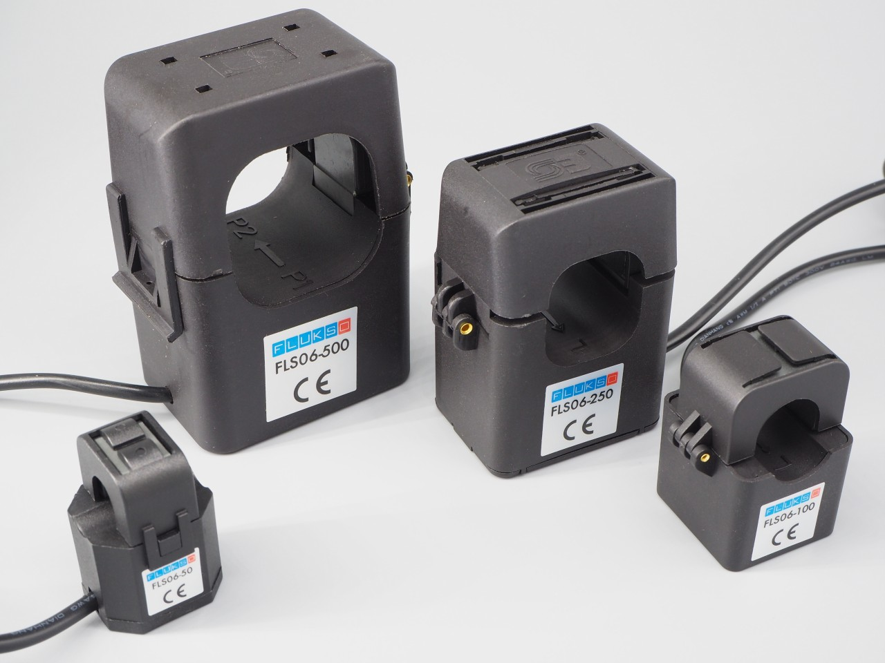
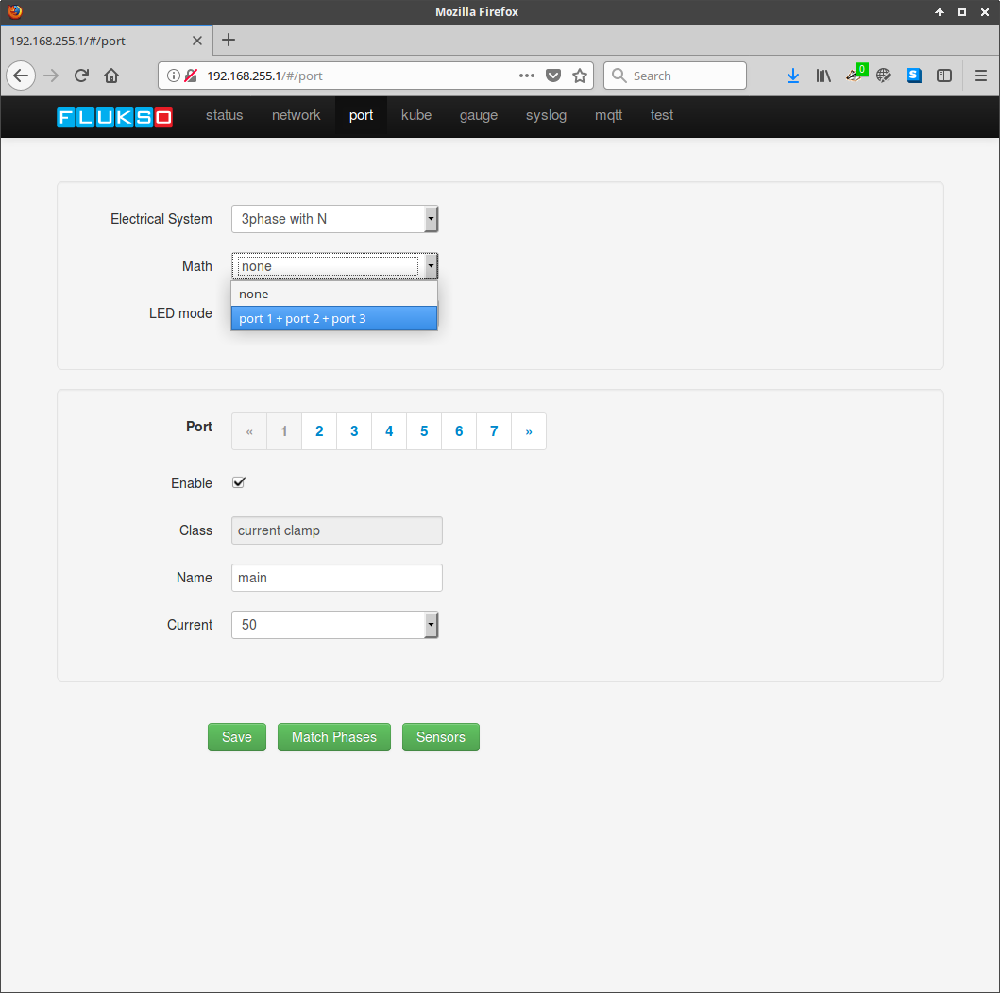

==============
Current Clamps
==============

Flukso offers four types of FLS06 current clamps: 50A, 100A, 250A and 500A. The
clamp type required for a specific installation depends on the maximum current
allowed through each wire. This value can be obtained by verifying the value
printed on the corresponding circuit breaker. One/three 50A current clamp(s)
will suffice for residential installations.

Consult :ref:`step_2` of the quickstart section for detailed installation
instructions.

For a 3-phase setup you can choose to bundle the measurements of the three
individual phases into a single reading. Select the 'port 1 + port 2 + port 3'
option in the math dropdown menu, then press save on the bottom of the page.

