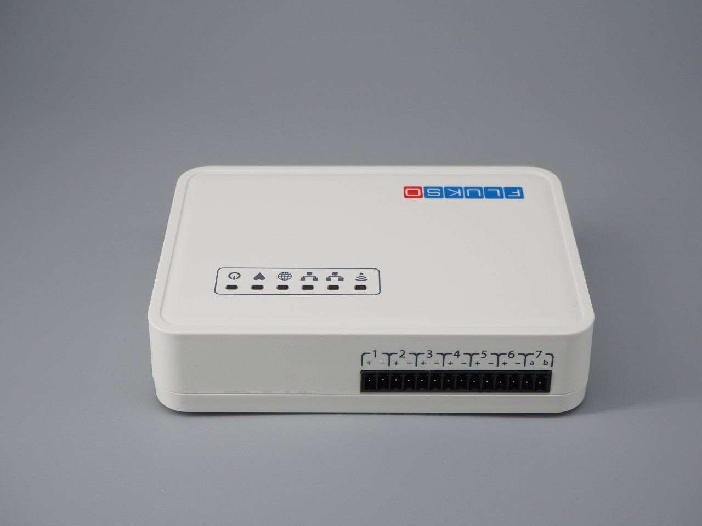
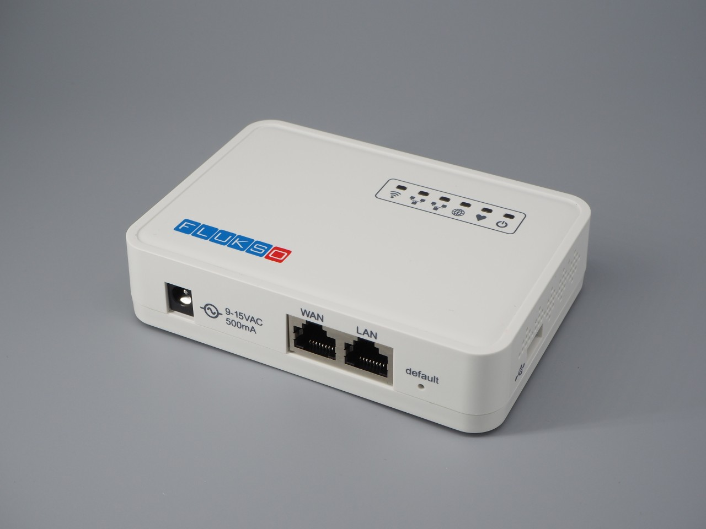
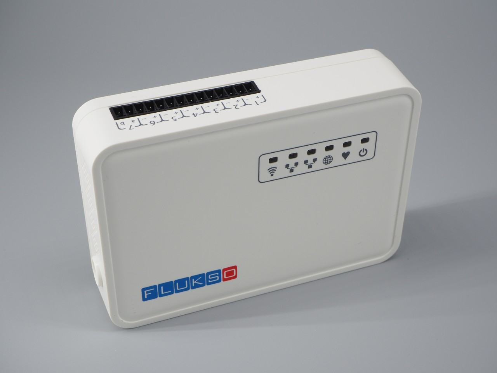

===========
Fluksometer
===========

We will in turn introduce the Fluksometer v3's ports, button and LEDs. The
Fluksometer v3 is currently available in a single 'E' version, a.k.a. FLM03E.

ports
=====

sensor ports
    The screw terminal contains fourteen inputs. A port on the screw terminal
    is defined as a pair of adjacent inputs. The port numbers are printed on the
    front of the enclosure for easy reference, with the polarity denoted by +
    and -.

    Ports #1 to #3 are current clamp ports that are tuned to accept Flukso
    FLS06-type split-core current clamps. Ports #4, #5 and #6 can be used for
    counting pulses. This includes support for the S0 interface (S0 is an open-
    collector interface standardized in DIN EN 62053-31) common to DIN-rail
    energy meters. Pulse ports accept Flukso water and gas probes as well. Port
    #7 can be hooked up to a NTA8130-compliant local P1 port found on Dutch
    smart meters. Contrary to the other ports, port #7 has its polarity
    indicated by the letters a (tx) and b (rx).

.. note:: The current FLM03E firmware still lacks the P1 port decoder. This
    functionality will be added in a future release.

ethernet
    Both ethernet ports support a 10baseT/100baseTx interface with auto-
    negotiation and auto MDI/MDI-X crossover detection. The right ethernet port
    (LAN) is meant for configuring the Fluksometer, while the left port (WAN)
    can be used as an internet uplink for the Fluksometer.

power port
    While the power port can still accepts a 9-15V DC voltage, we now ship all
    Fluksometer v3's with a 9V AC-AC adapter. The AC adapter acts as a power
    source to the FLM03 as well as the line voltage sensor.

USB
    The USB 2.0 type A port on the right side of the Fluksometer can accept a 3G
    stick. This allows the FLM to make a direct internet connection, bypassing
    the LAN.

button
======
The pushbutton has a dual function.  Which function will be triggered depends
on how long the button is pressed.  Make sure the heartbeat LED is blinking
before using the button.

Restore networking defaults
    If you press the button between 2 and 5 seconds, the Fluksometer will
    restore its default network settings.

Restore firmware
    Keep the button pressed for between 10 and 15 seconds to restore the
    Fluksometer’s stock firmware, which is then followed by a reboot. You will
    have to reconfigure all network and sensor settings. Connect to the local web
    interface after the heartbeat LED starts blinking again.

LEDs
====
The Fluksometer has six red LEDs on the top of its enclosure. Together these
LEDs provide an overview of the Fluksometer’s internal functioning, the status
of its network interfaces and its ability to communicate with the Flukso server.
From left to right, these LEDs are:

Wifi
    If the  wifi interface is enabled, the wifi LED will light up when the
    wireless connection is succesfully established. Network traffic crossing the
    wifi interface will trigger a blinking LED.
Ethernet
    Both ethernet LED will be on when their respective ethernet links, WAN/LAN,
    are established. This can either be a 10baseT or 100baseTX link in full- or
    half-duplex mode.
Globe
    After the Fluksometer has finished its boot sequence, the globe LED will
    be on when it can connect to the Flukso server via MQTT/SSL.
Heartbeat
    The heartbeat LED is positioned right next to the globe led.  While the
    globe LED informs us about the status of the Fluksometer’s external
    communication, the heartbeat LED allows us to monitor the Fluksometer’s
    internal health. This LED will be on when the sensor board is running its
    firmware. From the moment the flx daemon is started during the boot
    sequence, it will ping the sensor board every second. Each ping triggers
    a blink of this LED, thus mimicking a real heartbeat. Hence, a ’heartbeat’
    is an indication of fully booted Fluksometer, an active flx daemon, a
    sensor board running its firmware and proper communication between the main
    board and sensor board.
Power
    The power LED is directly connected to the internal 3.3V supply. A burning
    LED indicates that power has been applied to the device and the internal
    3.3V voltage regulator is working properly.

