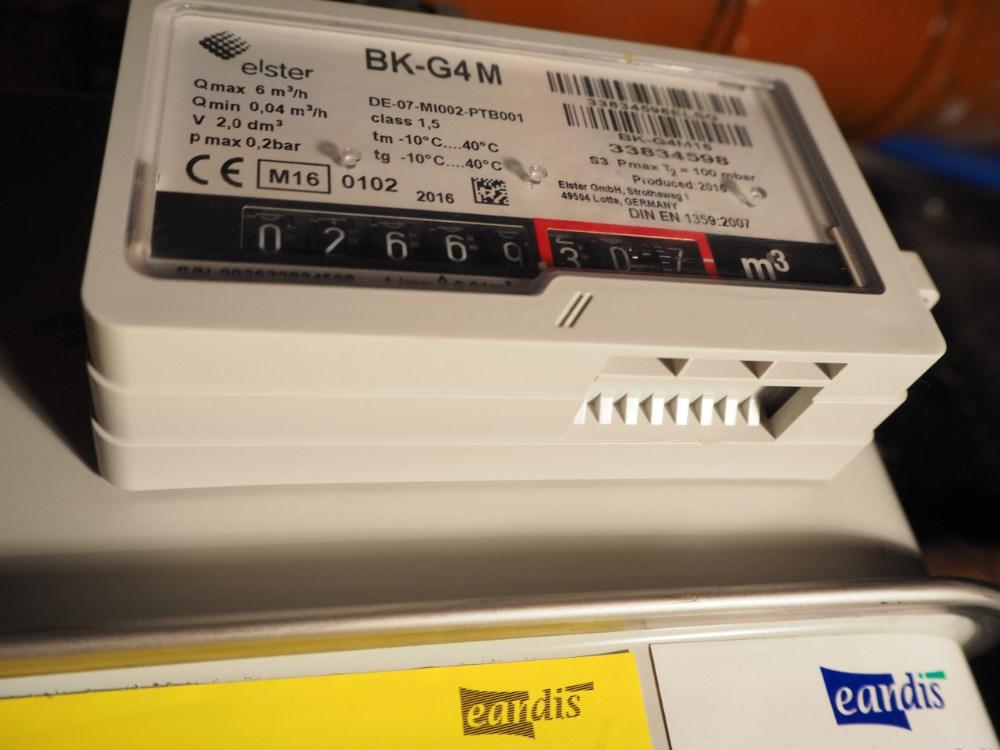
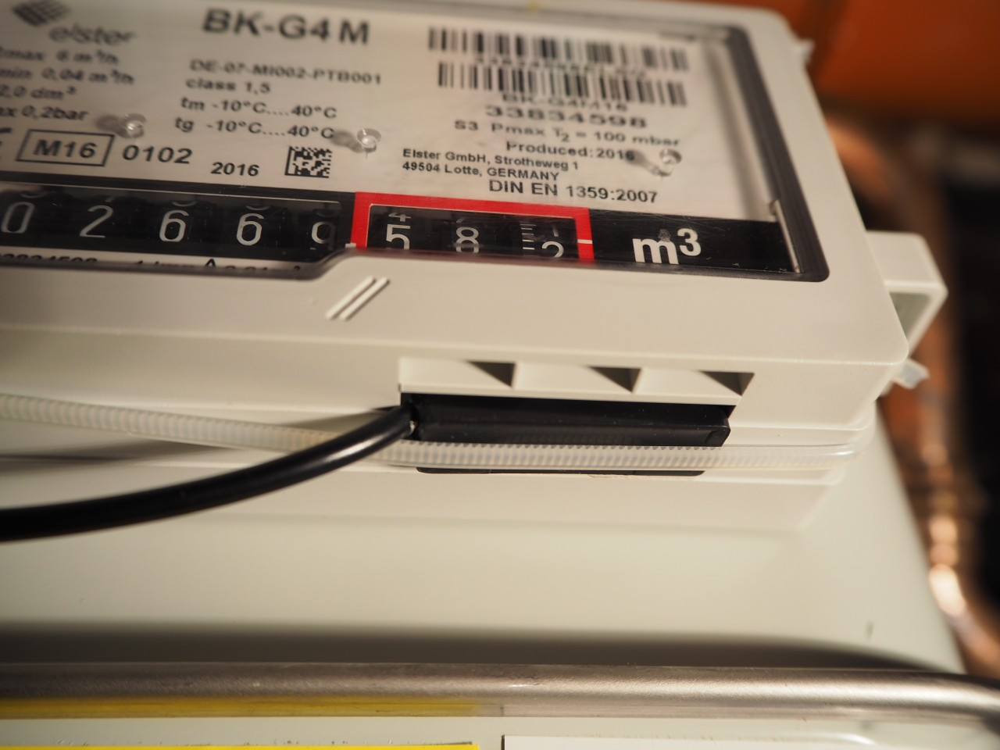
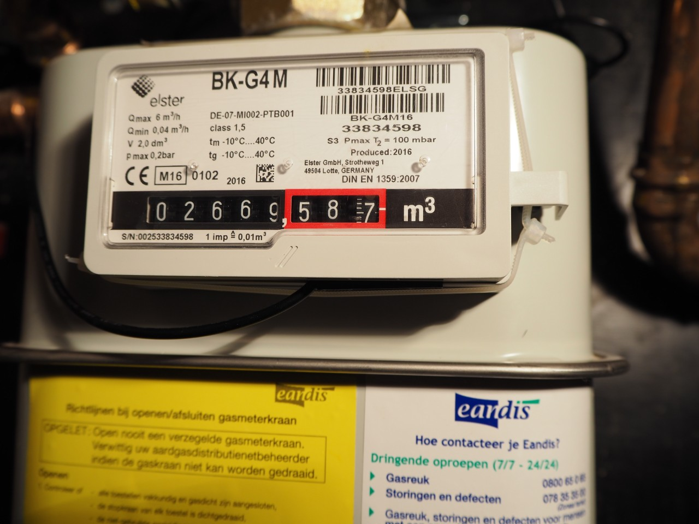
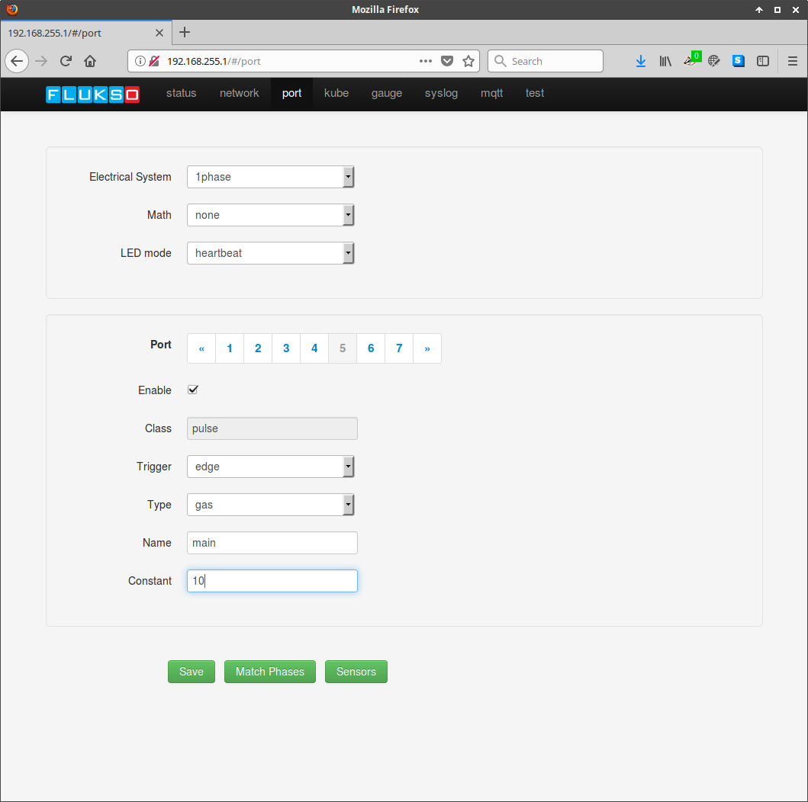

.. _gas_probe:

=========
Gas Probe
=========

Gas meters equipped with an internal magnet fixed to the last counter digit
can be read out with the FLS02-F2 gas probe. Look for a slot on the bottom of
the protruding counter element.

Insert the rectangular head of the probe into the slot. The probe's laser marks
should face upwards. For maximum sensitivity, the probe should be pulled to the
front right of the cavity

Secure the probe using either a plastic cable tie or some gummy adhesive.

Configure the FLM pulse port's meter constant to 10L per pulse for this
specific type of gas meter.

