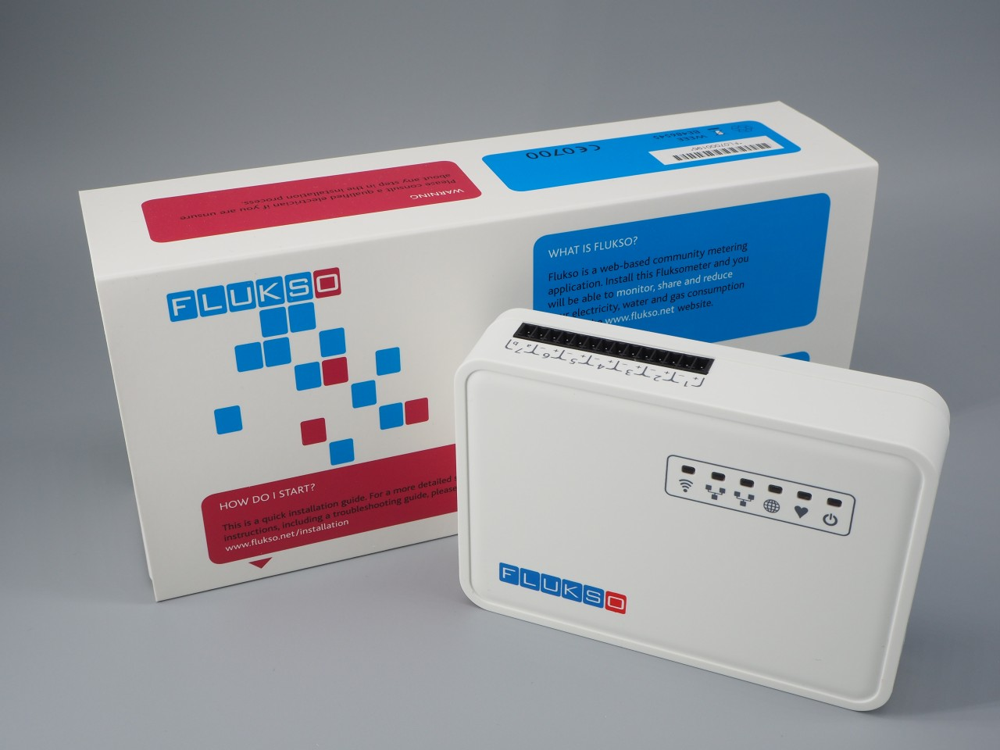

.. title:: Flukso

====================
Flukso documentation
====================

Welcome to the Flukso documentation pages! With this user guide we aim to
provide you with a thorough and visual description of how to properly install
and configure the Fluksometer and its sensors.

    The Fluksometer v3E

user guide
==========

.. toctree::
    :maxdepth: 3

    quickstart
    fluksometer
    current_clamps
    gas_probe
    water_probe
    opto-reflective_probe
    networking
    troubleshooting
