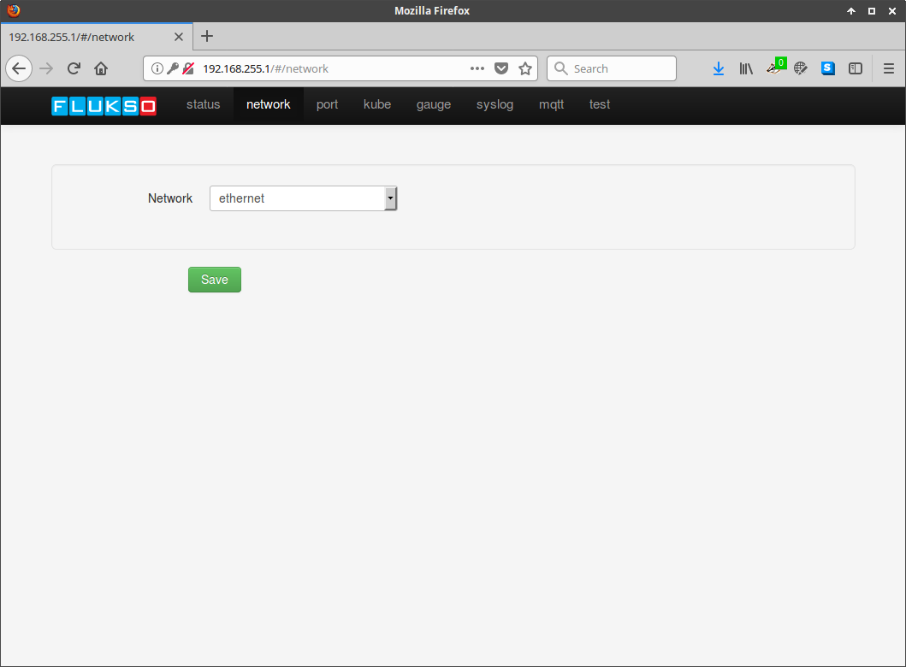
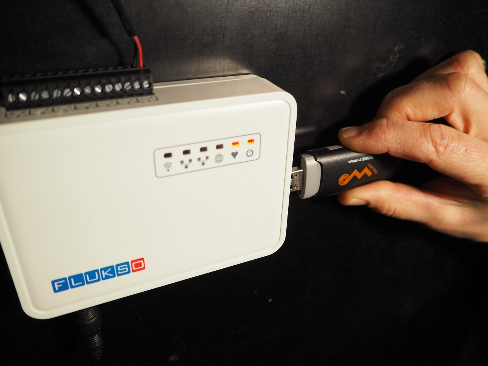
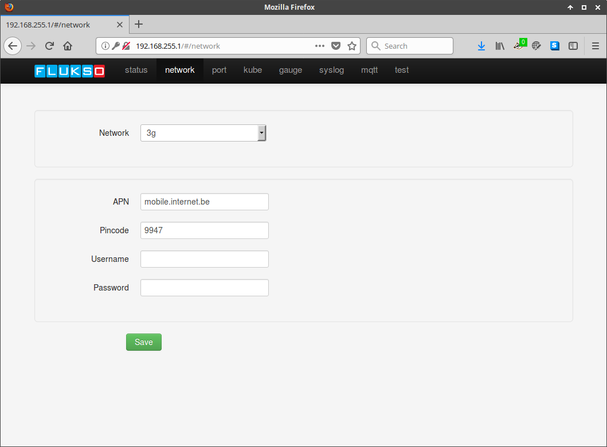

==========
Networking
==========

wifi
====

See :ref:`wifi` of the quickstart guide.

ethernet
========

To network the Fluksometer in ethernet mode, connect the ethernet cable to the
WAN port. Select the ethernet option on the network configuration page.

3G
==

When wifi or ethernet are not a viable networking option you can insert a 3G
stick into the Fluksometer's USB port. Make sure to power the FLM with the
provided 15V AC power supply.

Configure the APN and pincode on the network page. Username and password may be
required for certain providers.

