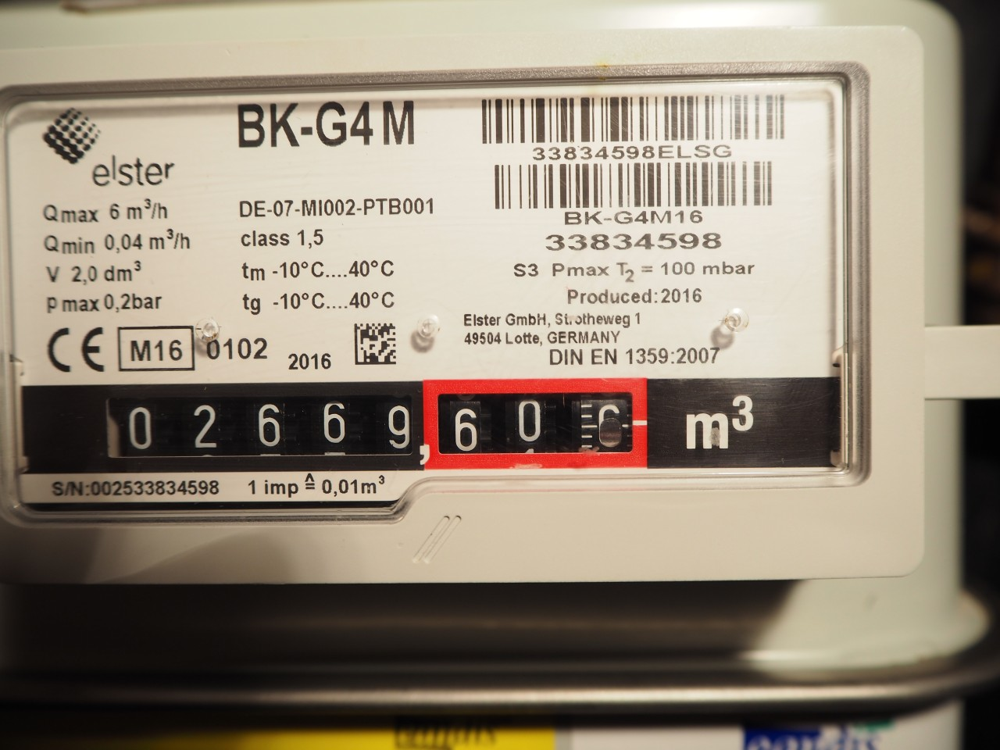
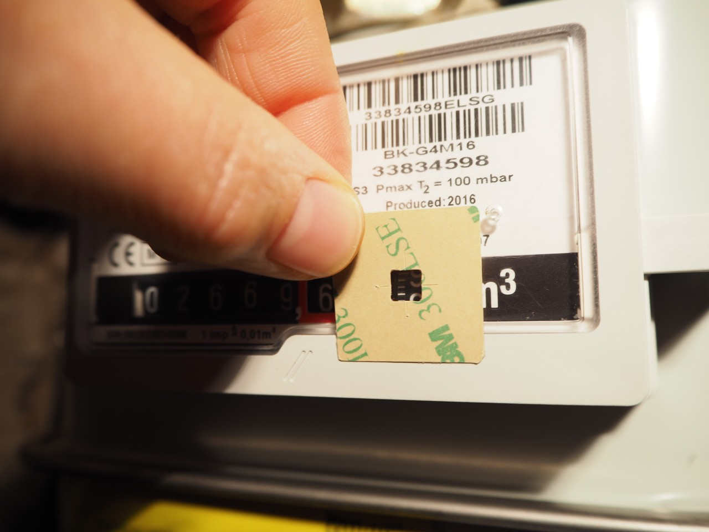
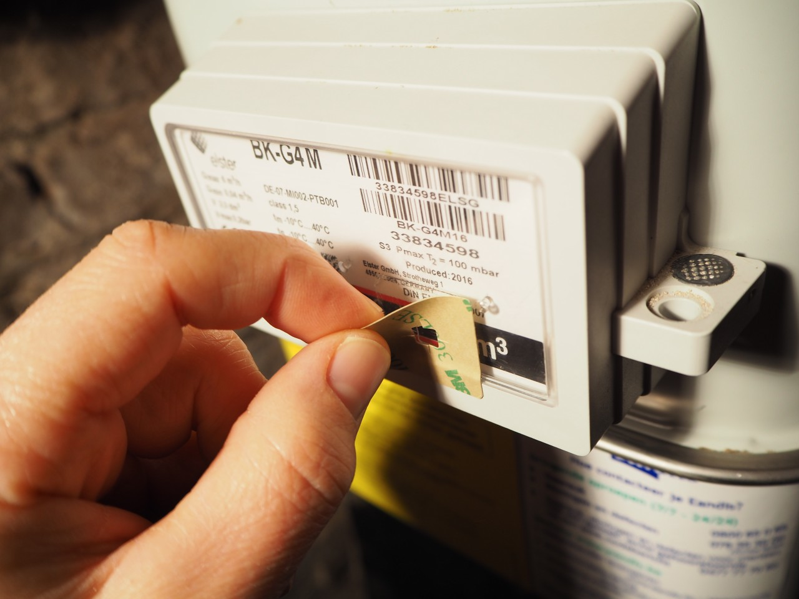
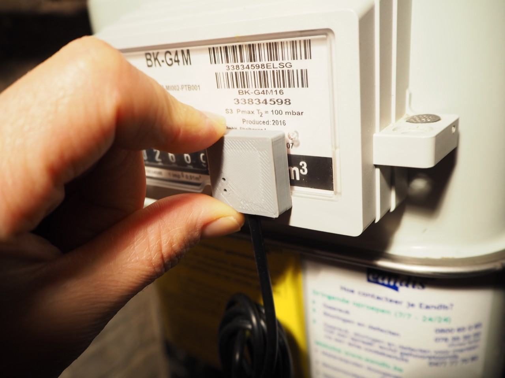
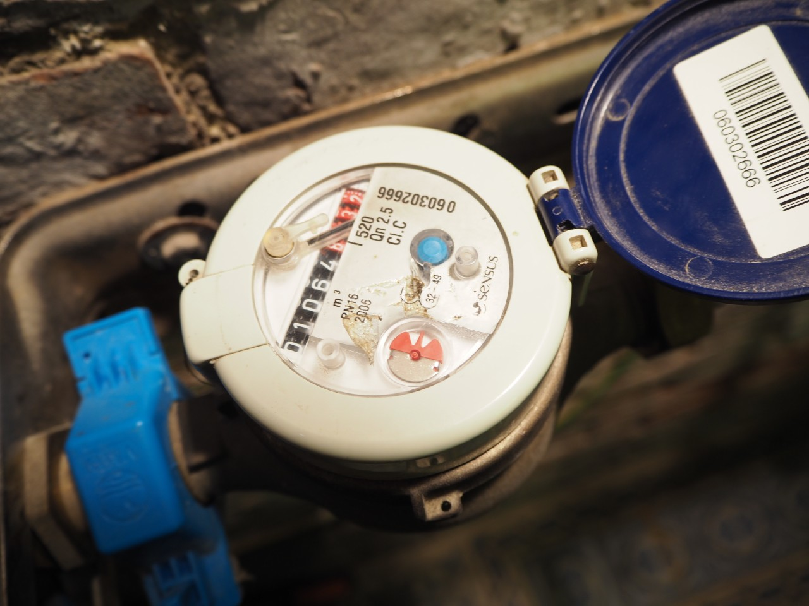
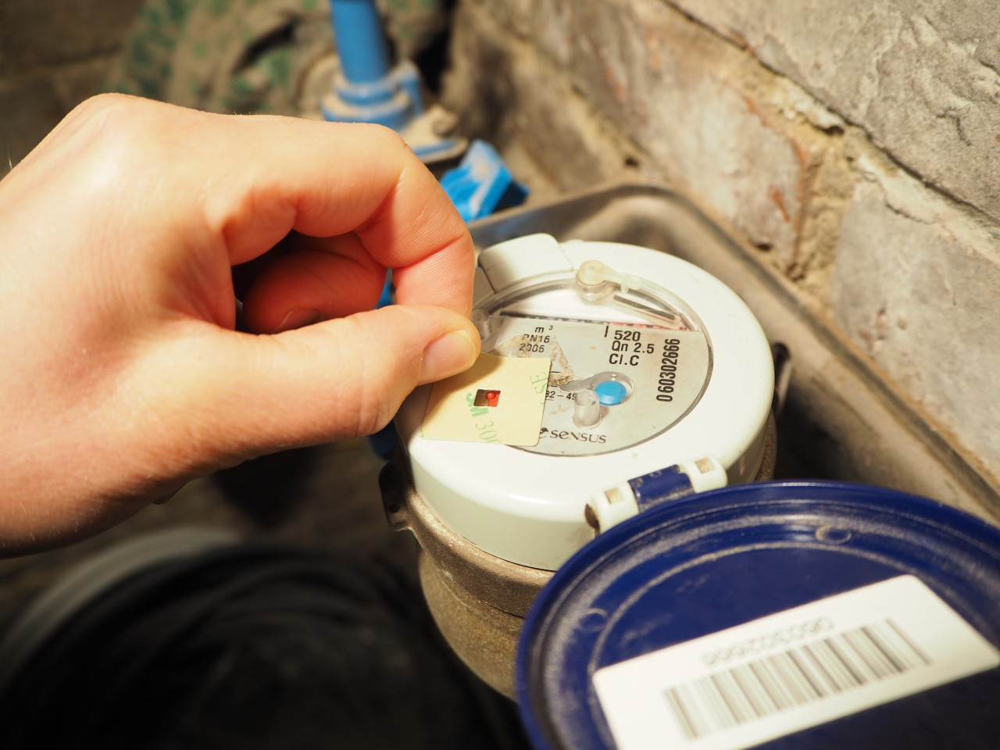
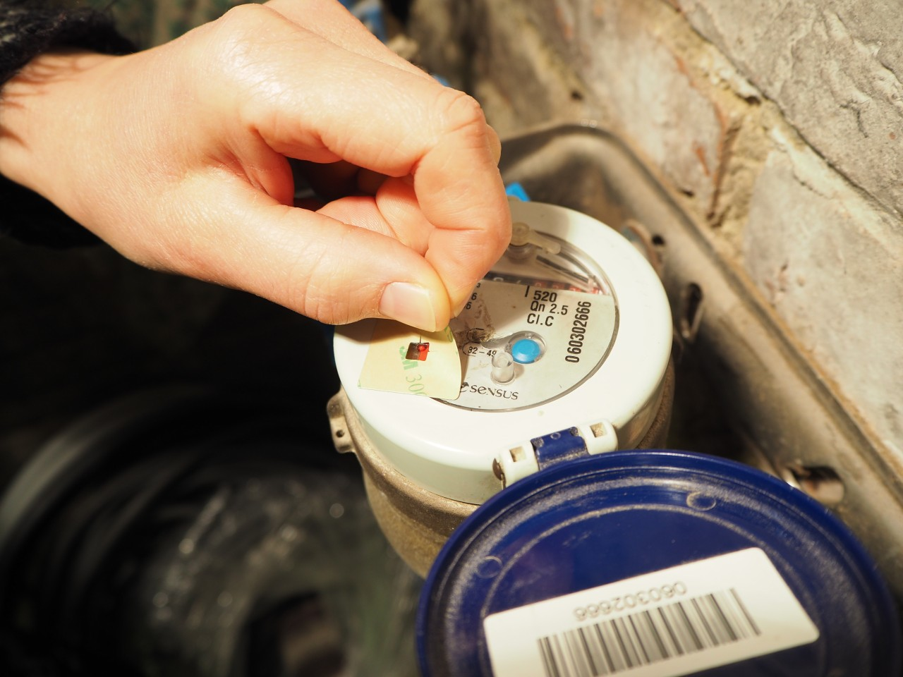
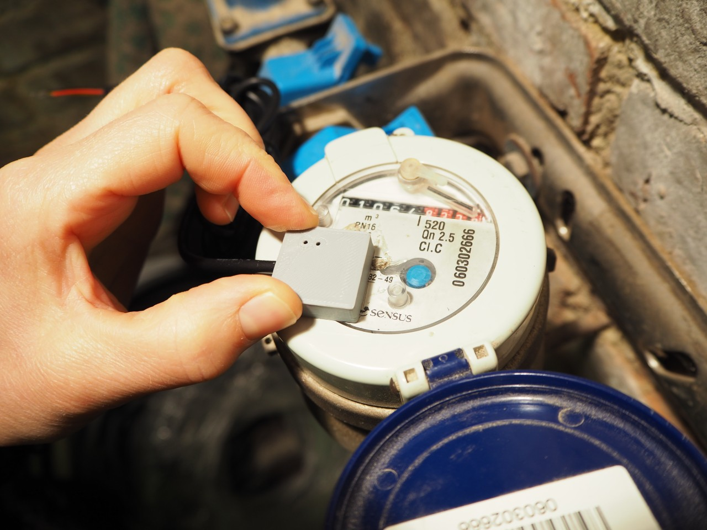

=====================
Opto-Reflective Probe
=====================

The FLS07A opto-reflective probe can read out gas and water meters equipped
with a mirror on their dials.

gas meter
=========

Look for a small mirror on the counter's last digit. For this specific meter
the mirror can be found on the '6' digit.

Attach the double-sided sticker to the glass of the meter. Make sure to align
the sticker so that the last digit is visible through the window.

Remove the sticker's cover to expose the tape.

Align the probe's head with the outer edge of the sticker. Firmly press the
probe onto the sticker.

Configure the pulse port's meter constant as detailed in the :ref:`gas_probe`
paragraph.

water meter
===========

This specific water meter has a half-moon mirror on the rotating dial.

Attach the double-sided sticker to the glass of the meter. The sticker's window
should be mounted excentrically on the dial so that the mirror will appear
below the mirror during half of the disk's full revolution.

Remove the sticker's cover to expose the tape.

Align the probe's head with the outer edge of the sticker. Firmly press the
probe onto the sticker.

Configure the pulse port's meter constant as detailed in the :ref:`water_probe`
paragraph. For this water meter the meter constant has to be set to 1L per
pulse.

