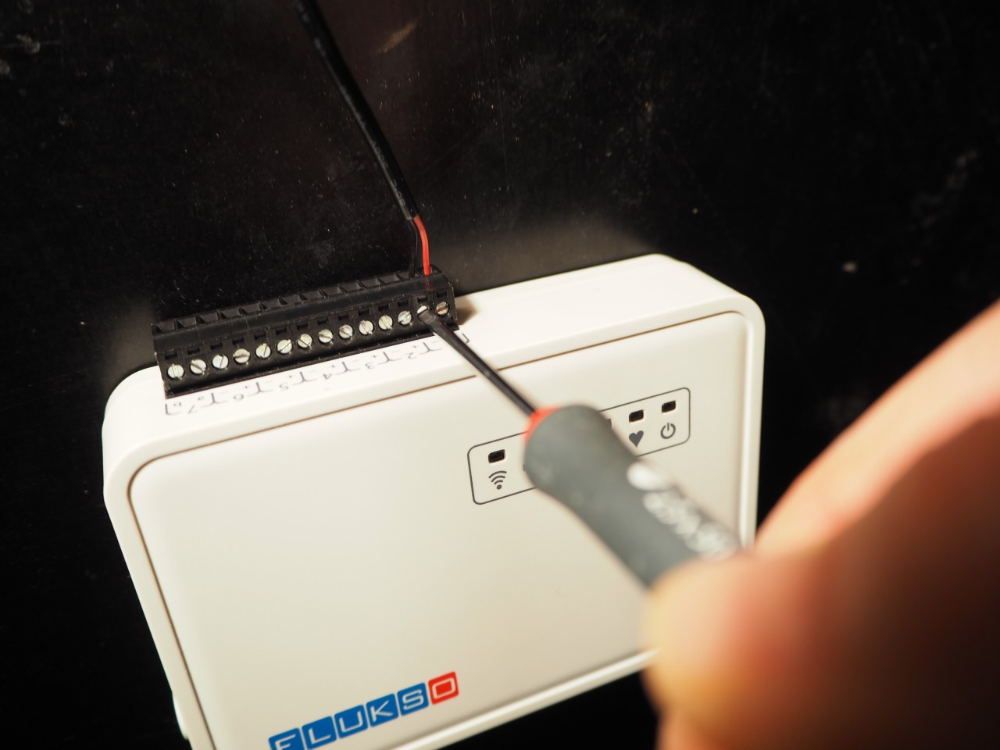

==========
Quickstart
==========

This quickstart will guide you through the installation steps that should lead
to your Fluksometer's [FLM] successful deployment. Please consult the
troubleshooting chapter if you experience any installation difficulties.

.. caution:: Please consult a qualified electrician if you are unsure about any
    step in the installation process.

step 1: secure the Fluksometer
==============================
Find a suitable location near the fuse box to install the FLM. Use the rear
mounting holes to fix the Fluksometer to the wall. The cardboard inside the
Fluksometer packaging will double as a drill template. Alternatively, strap
the FLM with a plastic cable tie.

.. _step_2:

step 2: attach the current clamps
=================================
For safety reasons, switch off the main electricity supply. Within the fuse box,
attach a current clamp to each of the live, non-neutral wires running from the
electricity meter. Close the clamp firmly. You should hear a slight click. The
lip should lie flush with the clamp's body. In the case of a 3-phase system,
make sure all clamps close in the same direction.

    single-phase electrical system

    three-phase electrical system

.. caution:: The live wire should be fully insulated. Never attach the clamp to
    a non-insulated live wire!

step 3: connect the clamps' cable
=================================
Connect the cable from each of the current clamps to one of the FLM's current
clamp ports (ports 1,2 or 3). Take care of connecting the black and red cable:
red to '+', black to '-'.

.. _wifi:

step 4: configure wifi & ports
==============================
Switch the main electricity supply back on. Power up your FLM by connecting the
power plug. Wait until a heartbeat is present on the heartbeat LED. Connect your
computer to the FLM's LAN ethernet port. Surf to http:\/\/192.168.255.1. Sign in
using the default user\/password settings. On the network tab, select the proper
wireless network and fill in the corresponding security key. The globe LED
should light up within one minute.

Proceed to the port page and configure each of the ports you wish to use on the
FLM. For a proper configuration, make sure to set the correct electrical system,
i.e. single-phase or 3-phase with(out) neutral. Press the 'save' button.
If applicable, temporarily disable your PV-panels. Turn on a sufficiently large
electrical load. Now press the 'match phases' button.

step 5: configure flukso.net
============================
Visit https:\/\/www.flukso.net\/user\/register to create an account. Then click
the cogwheels [top right] -> devices tab to associate the Fuksometer's serial
number with your account.

A first reading will be visible on the dashboard within five minutes.

