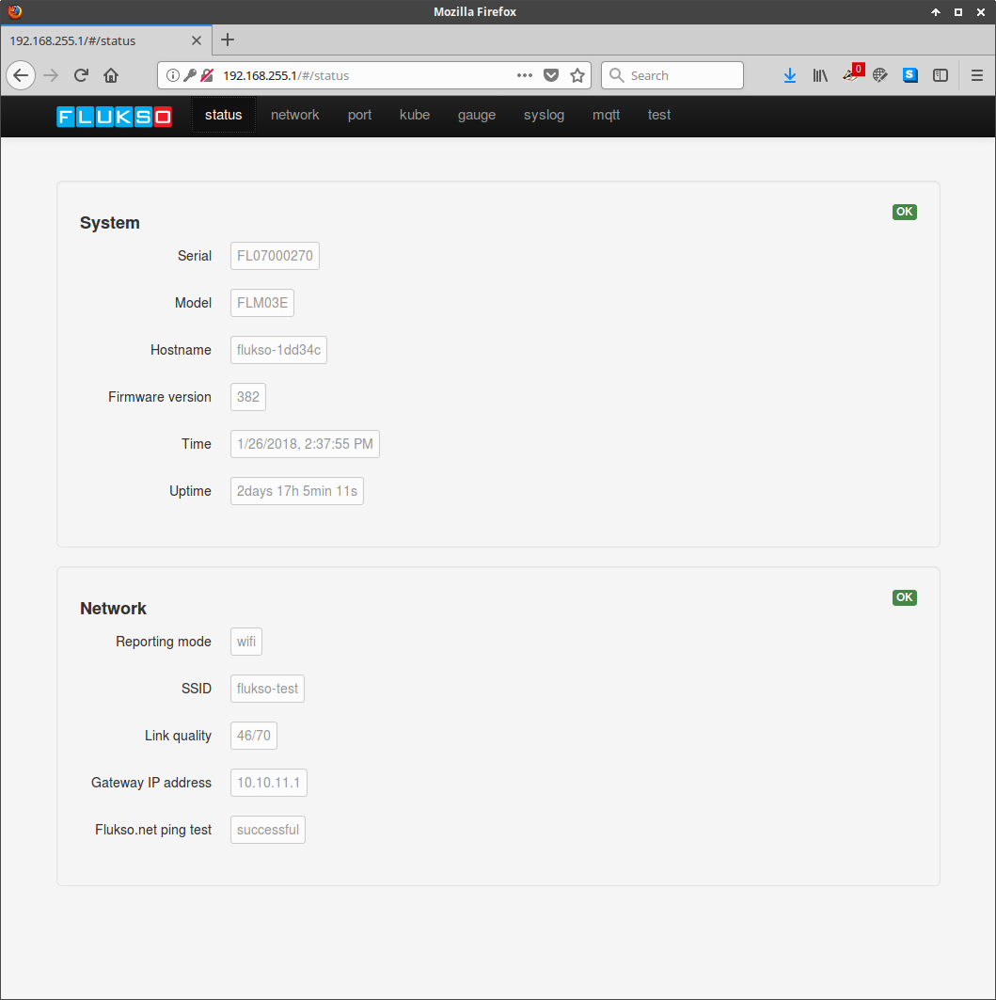
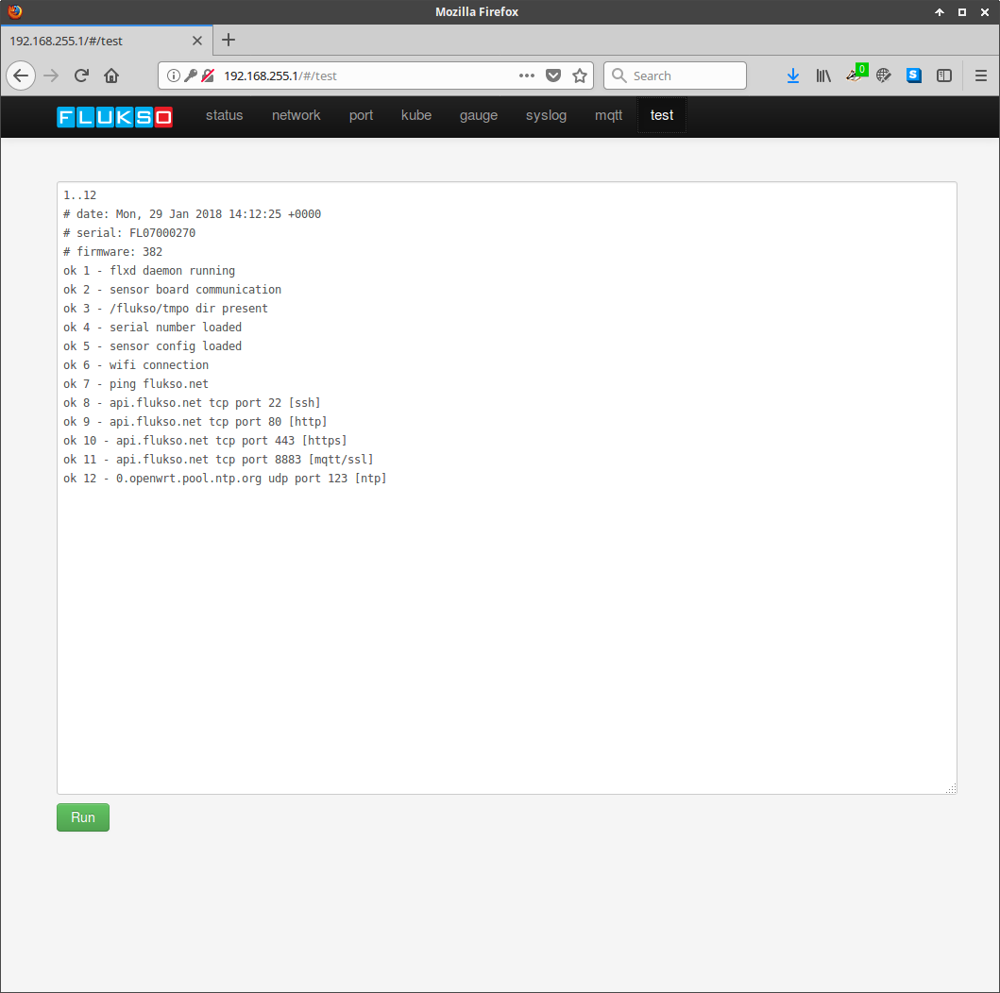
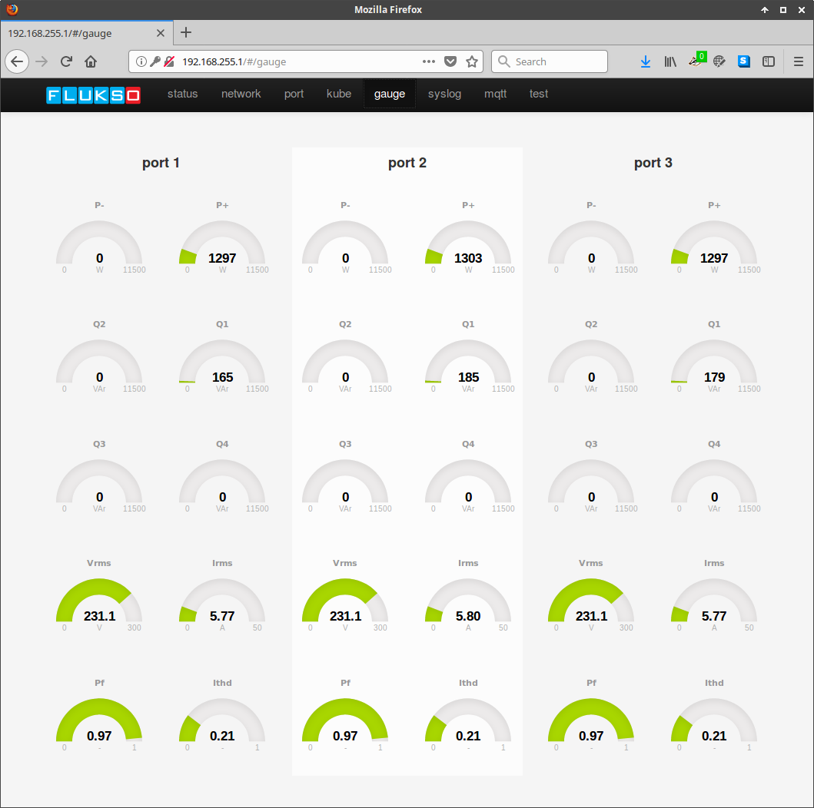
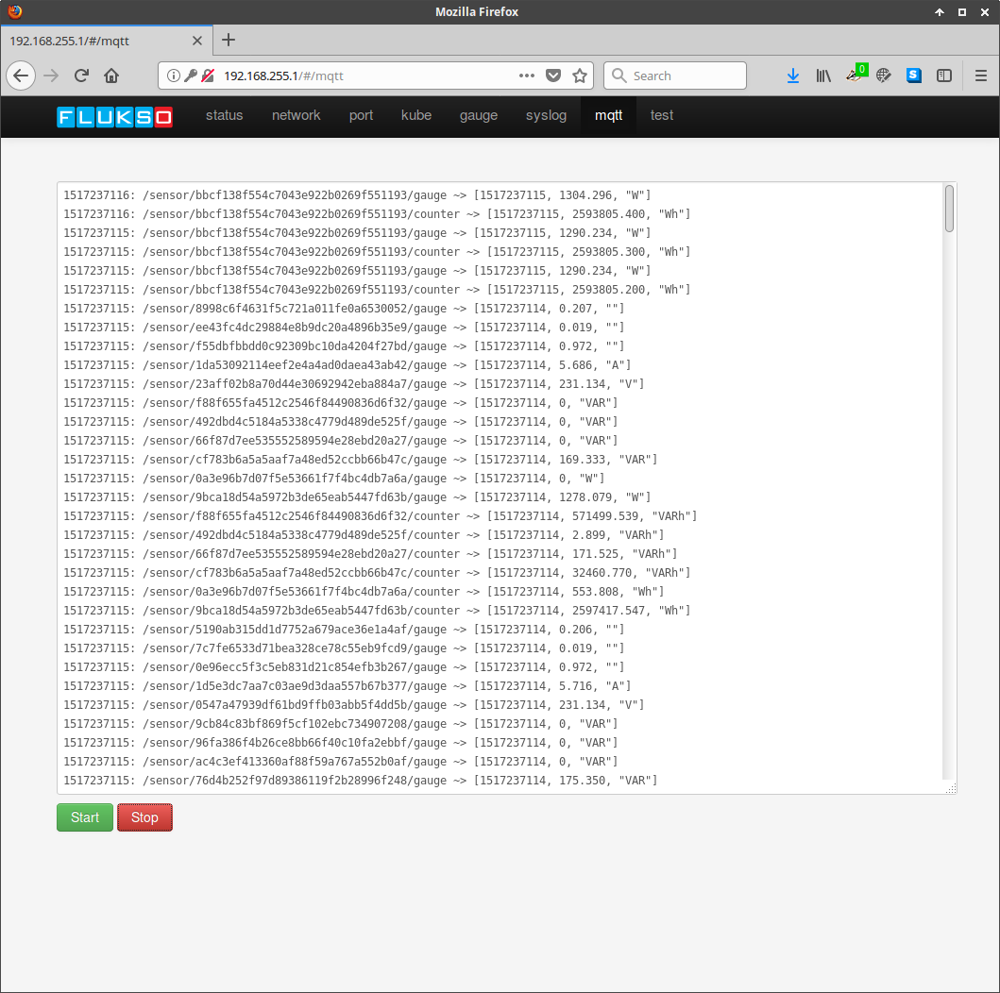
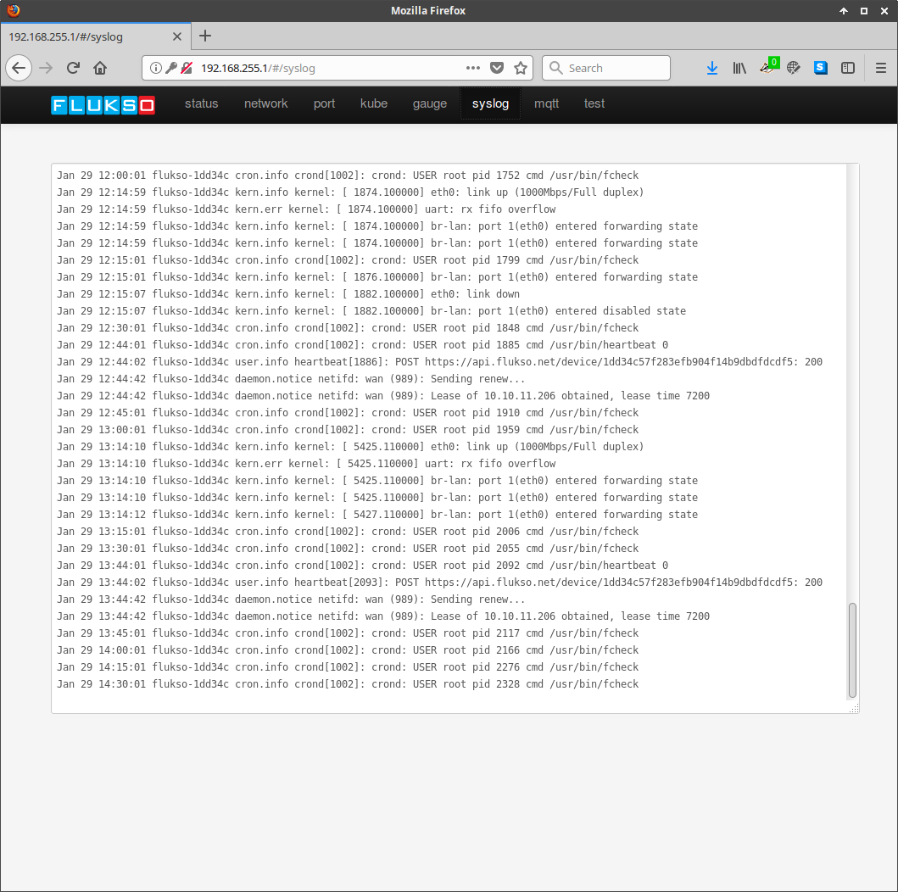

===============
Troubleshooting
===============

This section lists a set of pages on the local configuration interface that
will help you troubleshoot a Fluksometer installation.

status
======

The status pages details system- and network-level information. Both sections
should report an OK status in their top right corners. If not, an incorrect
time setting and/or network issues will be reported.

test
====

The test page provides further detail regarding the operational state of the
Fluksometer. It's an especially useful tool when debugging network issues. The
batch of tests can be re-run by pressing the 'run' button. All test should
report OK. Tests 8 through 12 check whether a firewall in the local network
(if present) blocks any of the required tcp/udp ports. If any network ports are
being blocked, please consult your network admin armed with the information
from the test page.

gauge
=====

The gauge page renders a set of real-time metrics for each of the current
clamp ports. Irms readings prove to be very useful when in doubt about the
correct installation or configuration of the current clamps.

mqtt
====

Sensor messages published to the on-board MQTT broker are subscribed to by
the mqtt page. It will display these messages anti-chronologically. You can
pauze the output of the message flow at any time to give you ample time for
inspecting the reported sensor readings.

syslog
======

The syslog page shows the contents of the Linux syslog circular buffer, which
might be helpful in some troubleshooting cases.

