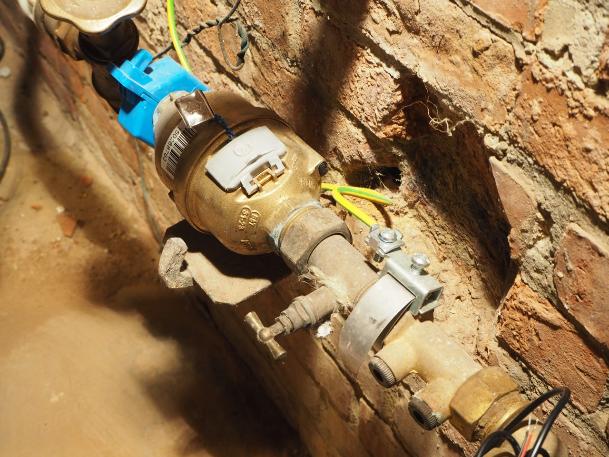

.. _water_probe:

Water Probe
===========

The Kent/Elster V100 water meter contains a magnet mounted on the last counter
digit as well. A black plastic cap can be found on the side of the meter.

Remove the cap. Two cavities will become visible. Insert the FLS02-T1 water
probe all the way into the biggest cavity.

Secure the probe with a plastic cable tie.

Configure the FLM pulse port's meter constant to 0.5L per pulse for this
specific type of water meter.

